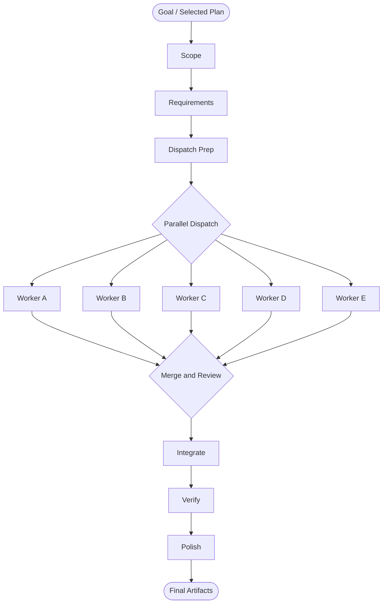
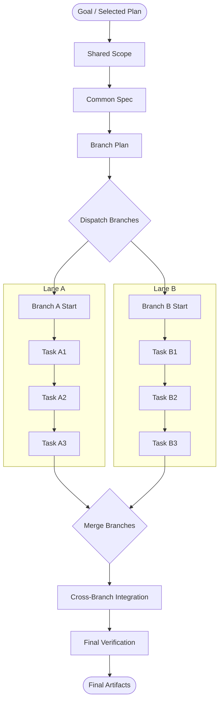
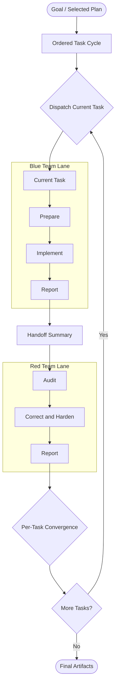

# Ralphite

Ralphite is a local-first, CLI-first multi-agent orchestrator for task, spec, and PRD-driven development, executed through `version: 1` YAML plans.

It is designed for real repositories: you start from a goal or starter plan, Ralphite runs that work through an explicit orchestration template, dispatches execution into isolated git worktrees, and gives you the operational layer around agent execution, including history, watch, recovery, replay, and optional agent-based first-failure recovery.

It is built for repo-scoped execution, explicit task structure, and repeatable operator workflows instead of one-off agent runs.

## Why Ralphite

- **Local-first:** runs against your workspace and keeps state under `.ralphite/`
- **Structured:** execution is driven by schema-backed `version: 1` YAML plans
- **Opinionated:** ships with predefined starter templates for common job shapes
- **Safer:** uses git worktrees to isolate agent execution and integration work
- **Operable:** includes `doctor`, `history`, `watch`, `recover`, `replay`, and `check`
- **Practical:** can automatically attempt a first recoverable failure with `agent_best_effort`

## What Makes It Different

Ralphite is not just a thin wrapper around an agent CLI.

It packages a full repo workflow around AI execution:

- predefined templates for bugfix, refactor, docs, and release-prep work
- explicit orchestration templates so the run shape matches the job
- isolated worktree execution and integration-aware merge handling
- typed runtime status, artifacts, and local run history
- live watch mode for ongoing runs
- explicit recovery flows when execution pauses
- optional auto recovery for the first recoverable integration failure

The result is a more durable loop for shipping changes with agents instead of just prompting them.

## AI Tooling Transparency

This repository is developed with AI coding tools, especially Codex, and Ralphite itself defaults to a Codex backend for headless execution.

That is intentional.

The project is partly a product and partly an operating model for AI-assisted software work: scoped plans, explicit acceptance criteria, controlled worktree execution, and recoverable runs. In practice, that means the project has been built and refined with the same class of tools it is designed to orchestrate.

## Features

- `init`: create a local `.ralphite/` workspace and bootstrap a starter plan
- `quickstart`: guided first-run flow (`doctor -> plan -> run`)
- `run`: execute a selected plan directly
- `watch`: stream events for an existing run
- `history`: inspect previous local runs
- `recover`: resume paused or failed runs with explicit recovery modes
- `replay`: rerun a prior execution in rerun-failed mode
- `validate`: check plan structure and compatibility
- `check`: run baseline local quality gates

## Requirements

- Python `3.13+`
- [`uv`](https://github.com/astral-sh/uv)
- `git`
- `rg`
- a supported backend executable in `PATH`
- `codex` for the default backend
- `agent` for the optional Cursor backend
- a workspace inside a git worktree
- an initial git commit before execution commands such as `run` and `quickstart`

## Quick Install

```bash
git clone https://github.com/AlbertoMussali/Ralphite.git
cd Ralphite
uv sync
uv run ralphite --help
```

If you want to run Ralphite in a fresh repository, initialize git first:

```bash
git init -b main
git add -A
git commit -m "initial workspace state"
```

## Quick Start

Bootstrap the local workspace and run the default Codex path:

```bash
uv run ralphite init --workspace .
uv run ralphite quickstart --workspace . --yes --output table
uv run ralphite run --workspace . --yes --output table
```

What happens:

- `init` creates `.ralphite/config.toml` and `.ralphite/plans/`
- `quickstart` runs readiness checks, bootstraps missing state, shows the selected execution config, and starts the first run
- `run` executes the chosen plan directly once the workspace is execution-ready

Useful operational commands after that:

```bash
uv run ralphite history --workspace . --output table
uv run ralphite watch --workspace . --output stream
uv run ralphite recover --workspace . --output table
uv run ralphite validate --workspace . --json
```

To enable automatic first-failure recovery for recoverable integration issues:

```bash
uv run ralphite run --workspace . --yes --first-failure-recovery agent_best_effort
```

## Starter Templates

Tracked starter plans live under [`examples/plans/`](examples/plans/) and are intended to be copied, renamed, and customized:

- [`starter_bugfix.yaml`](examples/plans/starter_bugfix.yaml): reproduce a reported issue, ship the smallest credible fix, and verify regression coverage
- [`starter_refactor.yaml`](examples/plans/starter_refactor.yaml): capture invariants, refactor safely, and verify behavior parity
- [`starter_docs_update.yaml`](examples/plans/starter_docs_update.yaml): update docs and examples from code-and-test truth
- [`starter_release_prep.yaml`](examples/plans/starter_release_prep.yaml): coordinate deterministic gates, cold-start checks, and release sign-off

Choose one during init:

```bash
uv run ralphite init --workspace . --template starter_docs_update --yes
```

## How Execution Works

At a high level, Ralphite does four things:

1. It resolves a plan or generates a starter plan from your goal.
2. It maps the work onto a supported orchestration template such as `general_sps`, `branched`, `blue_red`, or `custom`.
3. It dispatches tasks into controlled worktrees and tracks run state locally.
4. It leaves behind artifacts and recovery state so the run is inspectable instead of opaque.

Common artifacts live under `.ralphite/artifacts/<run-id>/`:

- `final_report.md`
- `run_metrics.json`
- `machine_bundle.json`

## Orchestration Templates

Ralphite supports multiple orchestration shapes so the execution graph matches the nature of the work rather than forcing every run through the same loop.

Below are the three core built-in patterns represented as simple execution topologies.

### `general_sps` (Sequential Parallel Sequential)

Use this shape when work benefits from a coordinated setup phase, a broad parallel execution middle, and a controlled integration and finishing phase.

- **Sequential pre-phase:** define scope, collect context, and prepare dispatch
- **Parallel core:** fan work out across multiple independent workers
- **Sequential post-phase:** merge, verify, and summarize the final outcome



### `branched`

Use this shape when a shared setup should feed multiple coordinated lanes, each with its own internal sequence, before the run converges again.

- **Shared trunk:** establish common scope and execution context once
- **Parallel branches:** run lane-specific subflows independently
- **Unified convergence:** merge branch outputs into one integrated result



### `blue_red`

Use this shape when each task benefits from a two-pass cycle: Blue implements first, then Red audits, scrutinizes, and hardens that same unit before the task is merged.

- **Blue first:** implementation pass for the current task
- **Red second:** audit, corrective fixing, and hardening pass on the same task
- **Serial per-task flow:** the cycle runs as Blue -> handoff -> Red -> merge, then moves to the next task



### `custom`

When the built-in patterns are not the right fit, Ralphite can also execute a custom orchestration shape defined by the plan.

The point is not to force one universal multi-agent pattern, but to make the orchestration explicit, inspectable, and matched to the job.

## Defaults

- Default backend: `codex`
- Optional backend: `cursor`
- Default model: `gpt-5.3-codex`
- Default reasoning effort: `medium`
- Supported runtime plan version: `1`

Example override:

```bash
uv run ralphite run \
  --workspace . \
  --backend codex \
  --model gpt-5.3-codex \
  --reasoning-effort medium \
  --yes \
  --output json
```

## Documentation

Detailed docs live in the repo and are split by audience:

- Operator first-run guide: [`docs/workflows/first-run.md`](docs/workflows/first-run.md)
- Documentation hub: [`docs/index.md`](docs/index.md)
- Contributor guide: [`CONTRIBUTING.md`](CONTRIBUTING.md)
- CLI contracts: [`docs/references/cli-contracts.md`](docs/references/cli-contracts.md)
- Plan schema reference: [`docs/references/plan-schema-reference.md`](docs/references/plan-schema-reference.md)
- Recovery workflow: [`docs/workflows/recovery.md`](docs/workflows/recovery.md)
- Generated command snapshot: [`docs/generated/command-contracts.md`](docs/generated/command-contracts.md)

## Verification

Recommended local checks:

```bash
uv run ruff check .
uv run --no-sync pytest -q
uv run --no-sync ralphite check --workspace /tmp/ralphite-strict-check --strict --output json
```

## License

This repository uses a dual-license model.

- Use permitted by [`PolyForm Internal Use 1.0.0`](LICENSE.md) is available under that license.
- Commercial use outside that license requires a separate commercial license from the repository owner.

For commercial licensing, contact Alberto Mussali at `albertomussalih@gmail.com`.
